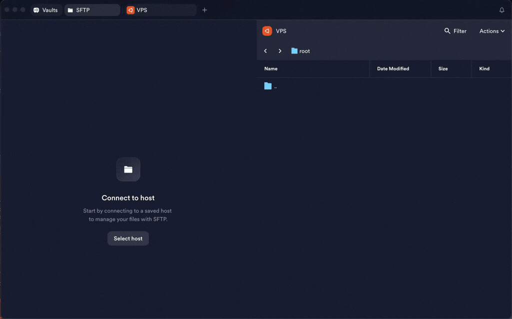

# Installing Backpack

## The normal way

One command as root on the VPS:

```bash
bash <(curl -fsSL https://raw.githubusercontent.com/AminMGMT/BackPack/main/install.sh)
```

It downloads the prebuilt release archive for your architecture (amd64/arm64)
into `/root/BackPack`, **verifies it against the checksum published with the
release**, installs the binary, and opens the menu when it finishes.

Reopen the menu any time with:

```bash
sudo backpack
```

Everything lands in a tidy layout — the release bundle in `/root/BackPack`,
backups in `/root/BackPack/backups`, tunnel configs in `/etc/backpack`. See
[server layout](server-layout.md).

> **Building from source** still works as a fallback: clone the repo and run
> `sudo bash install.sh` inside it. If the release download fails it builds with
> Go, fetching modules **directly first** and via Iran-friendly mirrors
> (RunFlare, goproxy.cn) only when direct access fails.

---

## Offline install (the server cannot reach GitHub)

Download the release on any machine **with** internet, copy it to the server, and
install it there. Nothing is fetched from the VPS.



From the [releases page](https://github.com/AminMGMT/BackPack/releases/latest),
download the archive for the server's architecture — run `uname -m` on it:
`x86_64` → `backpack_linux_amd64.tar.gz`, `aarch64` → `backpack_linux_arm64.tar.gz`.

### With the installer (recommended)

It also records the layout for the uninstaller. Download `install.sh` and
`SHA256SUMS` alongside the archive, put all three in the **same folder** on the
VPS, and run it. It finds the local archive, verifies it against `SHA256SUMS`,
and never touches the network:

```bash
scp install.sh SHA256SUMS backpack_linux_amd64.tar.gz root@SERVER_IP:/root/
ssh root@SERVER_IP "cd /root && sudo bash install.sh"
```

### By hand

Upload the archive to the server, then as root:

```bash
sha256sum backpack_linux_amd64.tar.gz        # compare against SHA256SUMS
tar xzf backpack_linux_amd64.tar.gz
mkdir -p /etc/backpack /root/BackPack/backups
install -m 0755 backpack /usr/local/bin/backpack
echo /root/BackPack > /etc/backpack/install_path
sudo backpack
```

The `install_path` line is what the built-in uninstaller reads to know what to
remove; skip it and everything still runs, but uninstalling has to be done by
hand. `install -m 0755` already sets the executable bit, so no `chmod` is needed.

### Updating offline

The same way: repeat the steps with the newer archive. `install` replaces the
binary in place, and your tunnels in `/etc/backpack` are untouched. Restart them
afterwards with `sudo backpack` → **Manage → Restart ALL**.

---

## Updating online

**Main menu → 8) Update.** It downloads the release, verifies it against the
published SHA-256, installs it, and **rolls back automatically** if a tunnel does
not come back up. Anything that cannot be verified is refused rather than
installed. [More](updates.md).

## Uninstalling

**Main menu → 9) Uninstall** removes everything Backpack installed.

---

<div dir="rtl">

## خلاصهٔ فارسی

**نصب عادی:** یک دستور با کاربر root روی سرور — آرشیو ریلیز مخصوص معماری سرور را
دانلود می‌کند، با چک‌سام منتشرشده **تأیید** می‌کند، نصب می‌کند و خودش منو را باز
می‌کند. بعداً با `sudo backpack` منو را باز کن.

**نصب آفلاین (سروری که به گیت‌هاب دسترسی ندارد):** فایل ریلیز را روی یک ماشین با
اینترنت دانلود کن و به سرور کپی کن. با `uname -m` معماری را ببین: `x86_64` یعنی
amd64 و `aarch64` یعنی arm64. بهترین راه این است که `install.sh` و `SHA256SUMS`
را هم کنار آرشیو در **یک پوشه** بگذاری و اسکریپت را اجرا کنی — خودش فایل محلی را
پیدا و تأیید می‌کند و اصلاً به شبکه دست نمی‌زند. روش دستی هم در بالا آمده؛ فقط
یادت باشد خط `install_path` را بنویسی، چون حذف‌کنندهٔ داخلی از روی آن می‌فهمد چه
چیزی را پاک کند.

**آپدیت:** از منوی اصلی گزینهٔ ۸ — با تأیید SHA-256 و **بازگشت خودکار** اگر تونل
بالا نیامد. آپدیت آفلاین هم همان مراحل نصب با آرشیو جدید است و کانفیگ‌های
`/etc/backpack` دست‌نخورده می‌مانند.

</div>

---
[← Back to the docs index](README.md)

---

*Last verified against Backpack v1.8.5.*
